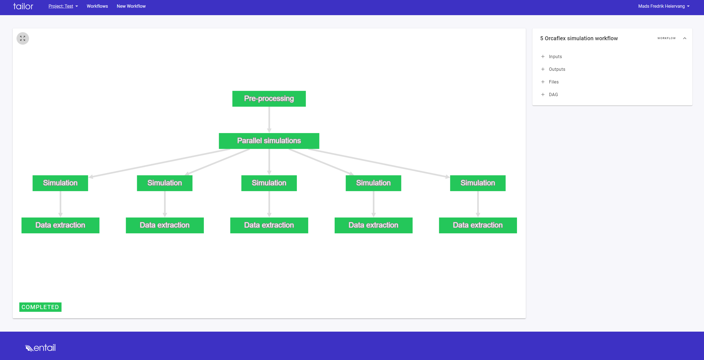
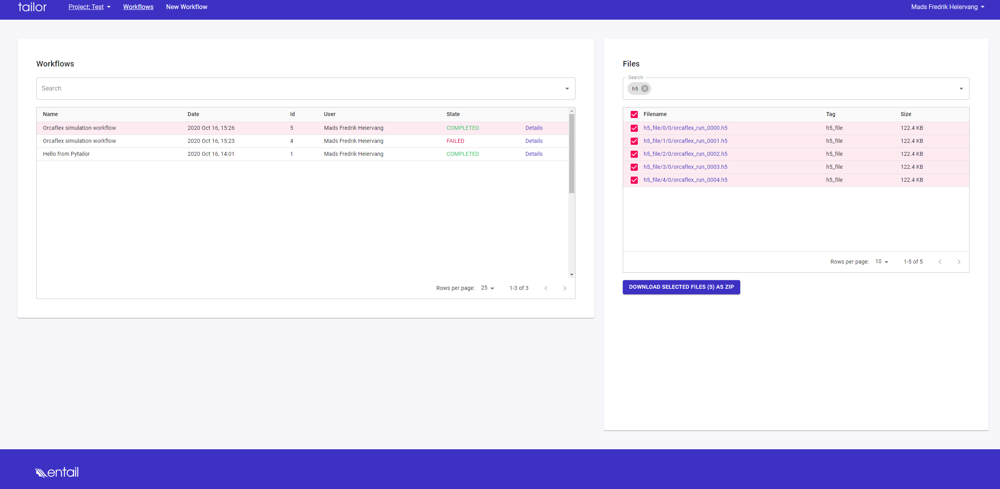

# Run Orcaflex Simulations in Paralell

To run the workflow, pytailor (pip installable), orcapack (pip installable) 
and OrcFxAPI with a valid license are prerequisites.

## Description of workflow

The following is done in the workflow

1. prepare input data for a set of simulations. This is handled by the function 
**orcapack.modelsetup.populate_orcaflex**, which does the following:
    - takes the input and generates a set of parameter dicts.
    - Branches out the dict to one parameter dict for each task.

2. run a set of simulations in parallel. A single simulation is handled by the 
function **orcapack.run.run_simulation**:
    - takes a .dat file as input
    - produces a .sim file as output

3. do post-processing of the simulation data.  This is handled by the 
function **orcapack.res2hdf5.sim2hdf5**.:
    - takes a set of .sim files as input
    - extract main results to the the [HDF5 format](https://portal.hdfgroup.org/display/HDF5/HDF5)


## Workflow example

### DAG

```python
from pytailor import PythonTask, BranchTask, DAG, Inputs, Outputs, Files, Project, \
    FileSet, Workflow
import orcapack

inputs = Inputs()
outputs = Outputs()
files = Files()

with DAG(name="Advanced orcaflex simulation dag") as dag:
    t1 = PythonTask(
        name="Pre-processing",
        function=orcapack.modelsetup.populate_orcaflex,
        kwargs={"datfile": files.base_file,
                "orcaflex_def": inputs.pre_proc_data},
        download=files.base_file,
        upload={"inp_file": "*orcaflex_run*.dat"}
    )
    with BranchTask(name="Parallel simulations",
                    branch_files=["inp_file"], parents=[t1]) as branch:
        with DAG(name="sub-dag for branching") as sub_dag:
            run_simulation = PythonTask(
                name="Simulation",
                function=orcapack.run.run_simulation,
                args=files.inp_file,
                kwargs=inputs.run_simulation,
                download=files.inp_file,
                upload={files.sim_file: "*.sim"}
            )
            extract_results = PythonTask(
                name="Data extraction",
                function=orcapack.res2hdf5.sim2hdf5,
                args=[files.sim_file[0], inputs.extract_data],
                download=files.sim_file,
                upload={files.h5_file: "*.h5"},
                parents=run_simulation
            )
```

### Inputs

```python
workflow_inputs = {
    "pre_proc_data": [
        {"Object type": "Environment",
         "Data name": "WaveHs",
         "Value": [4.0, 5.0, 6.0, 7.0, 8.0]},
        {"Object type": "Environment",
         "Data name": "WaveTp",
         "Value": 10}
    ],
    "run_simulation": {
        "calculate_statics": False
    },
    "extract_data": [
        {
            "Object type": "Line",
            "Object name": "Catenary Hose",
            "Object extra": 0,
            "Result names": [
                "X",
                "Y",
                "Z",
                "Effective tension",
                "x bend moment",
                "y bend moment"
            ]
        }
    ]
}
```


### Running workflow
```python
fileset = FileSet(prj)
fileset.upload(base_file=["testfiles/A01_Catenary_riser.dat"])


# create a workflow:
wf = Workflow(project=prj,
              dag=dag,
              name="Orcaflex simulation workflow",
              inputs=workflow_inputs,
              fileset=fileset)

# run the workflow
wf.run(distributed=True)
```

### Status and overview of running workflow



### Accessing results



or by api:
```python
wf.fileset.download(use_storage_dirs=False)
```